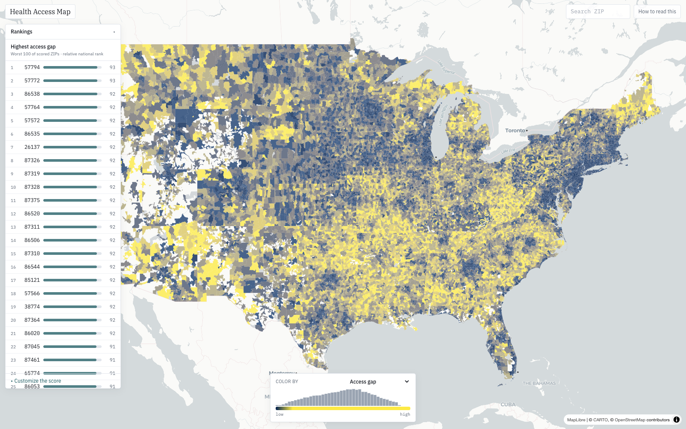

# Care Access Map

A national, ZIP-level (ZCTA) explorer of U.S. health-care access.

> **New here?** Start with [`docs/METHODOLOGY.md`](docs/METHODOLOGY.md) - the "follow the
> logic" guide: every design choice, its rationale, and how to extend the model safely. Then
> [`docs/PRIMER.md`](docs/PRIMER.md) (dataset/field dictionary),
> [`docs/RATIONALE.md`](docs/RATIONALE.md) (per-formula math + precedent),
> [`docs/DECISIONS.md`](docs/DECISIONS.md) (the ledger of what we tried, kept, and rejected -
> don't re-run these), [`docs/VALIDATION.md`](docs/VALIDATION.md) (outcomes, the sub-county
> gate, comparability, and uncertainty), and [`docs/BACKLOG.md`](docs/BACKLOG.md) (open edges &
> known limitations as pick-up-ready tickets - start here if you're extending the project).

The model is **hierarchical**: one tunable **Access Gap** composite → 3 dimensions →
scored sub-scores plus context/process indicators → ~50 measures, all drill-downable in the detail panel.

1. **Health need** - chronic disease, behavioral risk, mental/social health, disability (CDC PLACES)
2. **Social vulnerability** - socioeconomic, housing/transport, unmet social needs, and digital/telehealth barriers (Census ACS + PLACES SDOH)
3. **Care access** - provider supply (**2SFCA spatial catchment**, not ZIP containment), HPSA shortage, insurance, and medical-debt burden; safety-net and preventive-use rows are displayed as context/process indicators, not scored
4. **Access Gap Score** - the relative national-rank composite of the three

The map is the product: pan/zoom a cividis choropleth, click a ZIP for a decomposed
detail panel, switch the coloring metric, search a ZIP, read a ranked list of
worst-access areas, and **re-weight the score live with sliders** (recomputed
client-side - no backend round-trip). The sliders are an honest **sensitivity probe, not a
control that rewrites the map**: because the three dimensions are strongly collinear,
re-weighting moves ranks by only Spearman ~0.999 / ~±6 pts (see Scoring methodology below) -
that near-inertness is the finding, deliberately surfaced rather than hidden behind a knob that
looks more powerful than it is.



---

## How to read this map

**A relative screening lens for where health-care-access disadvantage concentrates - not an
absolute verdict, an eligibility tool, or a causal claim.** A score of 95 means "worse access
than 95% of U.S. ZIPs," not "objectively bad." Use it to *prioritize investigation*, not to
settle it.

| | |
|---|---|
| **Trust it for** | Broad geography (regional clusters, high-gap belts, urban/rural contrasts), state-level targeting, and the dimension pattern behind a headline score. |
| **Trust it coarsely for** | Decile-scale ZIP comparisons (top-decile vs middle vs low-gap). The UI leads with deciles + a 5-95 reliable rank band for this reason. |
| **Don't trust it for** | Fine rank order. Two ZIPs are reliably different only ~10-15 percentile points apart (~7-10 tiers, not 33,000 ranks). If two reliable ranges overlap, treat the ZIPs as tied. |

**What it is.** A transparent hierarchy (≈50 measures → sub-scores → 3 dimensions → one
composite). Two distinct claims, kept separate: it is **internally reliable** (split-half
**0.95** - the ~50 measures cohere; this is internal consistency, *not* outcome validity), and it
**tracks 6 independent outcomes** it never ingests (CMS claims + NCHS vital records, never the
BRFSS/PLACES inputs): life expectancy (+0.52), premature death (+0.49), and - against the
access-sensitive ruler the field actually uses - treatable/amenable mortality net of deprivation
(care-access partial r **+0.395**, state-blocked 95% CI [0.33, 0.46]). Read those correlations'
*precision, not their decimals*: 5 of the 6 outcomes are **county-level**, broadcast to ZCTAs, so
the honest sample is ~3,225 counties / ~50 state blocks - **not** 33k ZIPs - and every CI here is
spatially clustered to match (see [`docs/VALIDATION.md`](docs/VALIDATION.md) §1, §4).
Sub-county discrimination is confirmed in **five states + nationally**.

**What it is not - and read this before acting.** It is **descriptive, not causal.**
Cross-sectionally the index is **statistically indistinguishable from a poverty/deprivation map**
(a negative-control test returns a clean null - it does not flag deaths timely care could have
prevented over those it could not), and the one temporal "access lever" signal was **overturned by
a cross-state falsification control**. So the map tells you *where* access disadvantage is
concentrated; it does **not** demonstrate that putting a clinic, coverage, or program where the
index is high will *change* outcomes. It is also not complete access reality - capacity, Medicaid
acceptance, appointment availability, hours, and true drive-time are only partly observed or
proxied (see the 5 A's coverage in the methodology panel). Treat it as exploration, grant
targeting, needs assessment, and hypothesis generation - not precise ranking, eligibility, or
diagnosis.

> The full uncertainty accounting (rank bands, selection-bias caveat, PLACES circularity bound,
> the complete causal ladder) lives in [`docs/VALIDATION.md`](docs/VALIDATION.md) §5-§7 and the
> in-product **"How to read this"** panel.

---

## Quickstart

```bash
make setup            # venv + python deps + mapshaper + frontend deps
cp .env.example .env  # then paste your free Census API key (api.census.gov/data/key_signup.html)

make data-ca          # fast California vertical slice (minutes) -- recommended first
# or
make data             # full national build (~33k ZIPs; NPPES is a ~1 GB download / ~11 GB unzip)

make api              # FastAPI backend on :8000   (terminal 1)
make web              # Vite dev server on :5173    (terminal 2)
make acceptance       # run the acceptance suite
```

Validation-only targets are heavier: `make causal` and `make fqhc-lever` (the §7 causal frontier)
hit live data sources. `make fqhc-lever` in particular streams the Texas DSHS PUDF for 2011-2019 on a
fresh clone (~150-700 MB/quarter; only the small ZIP-level aggregates are cached, never the raw files),
so its first run is slow. These are read-only diagnostics and never feed the shipped composite.

Requires Python ≥ 3.10, Node ≥ 18, ~25 GB free disk for the national NPPES stage.

---

## Architecture

```
data/raw/*  ──(pipeline: Python + DuckDB + mapshaper + tippecanoe)──►  metrics.parquet
                                                  zcta.pmtiles + zcta_overview.geojson (geometry)
                                                                 │
                          ┌──────────────────────────────────────┼───────────────────────────┐
                          ▼                                       ▼                            ▼
                   FastAPI (in-memory parquet)        pmtiles + overview + metrics.json   static files
                   /api/zcta /api/rankings /api/compare    copied to frontend/public     (Vite / CDN)
                          │                                       │
                          └──────────────► React + deck.gl + MapLibre map ◄───────────────────┘
```

- **DuckDB** streams the ~11 GB NPPES CSV (projecting 3 columns) - never loaded into pandas.
- **SQLite/Postgres rejected**: 33k rows of attribute lookups fit trivially in memory.
- **Hybrid geometry**: a small all-ZCTA overview (mapshaper, heavily simplified) keeps the national
  choropleth dense at low zoom, while detail streams from range-requested **PMTiles** vector tiles
  (tippecanoe) at z>=6 - so cold-load geometry and resident memory stay bounded.
- **Base metrics precomputed server-side; the Access Gap is recomputed client-side** from the
  stored component percentiles, which is what makes the weight sliders instant.

See `pipeline/` for the stages and `data/processed/provenance.json` for the exact
dataset ids and vintages each run resolved.

---

## Data sources & vintages

| Layer | Source | Notes |
|---|---|---|
| Disease & health need | CDC PLACES, ZCTA GIS-Friendly (2025 release, `kee5-23sr`) | Crude prevalence across ~30 measures - chronic disease (diabetes, CHD, COPD, …), behavioral risk, mental/social distress, disability, plus SDOH + preventive-care use. Dataset id resolved + asserted at runtime. |
| Provider supply | CMS NPPES monthly full file | Individuals only (Entity Type 1); taxonomy classified via the NUCC crosswalk. |
| Economic / insurance | Census ACS 5-year (2023) | Variable codes resolved by label from `variables.json`; uninsured summed from the `B27001` group in one call. |
| Geometry | Census TIGER `cb_2020_us_zcta520_500k` | The only vintage that publishes ZCTA cartographic boundaries; field `ZCTA5CE20`. |
| Human geography | Census ZCTA→county relationship (2020) + NPPES | County name from the relationship file (dominant by land area); city is the modal provider city from NPPES; full state name + median age for context. |

**Vintage alignment:** PLACES, ACS, and TIGER are all kept on the **2020 ZCTA** basis so
the join doesn't silently drop ZCTAs that were renumbered between the 2010 and 2020 vintages.

---

## Scoring methodology

A hierarchy (SVI method - percentile-rank, average, **re-rank at each level** so every node is
a uniform 0-100 "higher = worse"). See [`docs/METHODOLOGY.md`](docs/METHODOLOGY.md) for the full logic.

1. Each **measure** (~50) is oriented (higher = worse access) and percentile-ranked nationally
   (ordinal → immune to the heavy right-skew of provider density / income).
2. **Sub-scores** = re-ranked mean of their available member percentiles. Some rows are computed
   and displayed but **unscored** when validation says they are context/process measures rather than
   upstream barriers: `safetynet_access` is wrong-signed *within* counties, and `preventive_use` is
   realized care use rather than a scored barrier (see [`docs/VALIDATION.md`](docs/VALIDATION.md)).
3. **Dimensions** (3) = re-ranked mean of their sub-scores: health need, social vulnerability,
   care access.
4. **Access Gap = 0.35·need + 0.30·vulnerability + 0.35·care-access** (default; a conceptual
   value judgment, as in County Health Rankings). The client sliders re-weight live from the
   stored dimension percentiles. A **multiplicative "coincidence" lens** (weighted geometric
   mean - lights up only where need *and* barriers coincide) is selectable alongside the additive default.
5. A ZCTA is **scoreable** only with population present and ≥ 2 of 3 dimensions; otherwise it
   renders gray. Low-population ZCTAs are flagged `low_confidence` and kept out of headline rankings.

The three dimensions are **strongly collinear** (need↔vulnerability **0.73**, need↔access
0.59, vulnerability↔access 0.61; reported in `provenance.json` and the methodology panel).
At the dimension level PC1 explains **76%** of the joint variance and the participation ratio
is **~1.6 effective dimensions** - the index is closer to one "general deprivation" gradient
than to three independent axes. Two consequences, both stated in-product: (a) the weighted sum
double-counts shared variance, which is why the weights are user-tunable rather than presented
as truth; and (b) because the dimensions move together, *re-weighting barely moves ranks*
(Spearman ~0.999, ~±6 pts) - so the sliders are an honest **sensitivity probe**, not a knob that
rewrites the map. (An earlier draft cited "~0.5" here; the live build is higher - see the
bootstrap-gate note in `docs/VALIDATION.md`.)

---

## Limitations (read this - integrity hidden is integrity absent)

This tool can mislead about real communities. Each flaw below is stated plainly in the
in-app **"How to read this"** panel as well:

- **Relative, not absolute.** A score of 95 means "worse access than 95% of U.S. ZIPs,"
  not "objectively bad." Absolute values are shown beside every percentile.
- **Modeled disease estimates.** PLACES is a model partly conditioned on socioeconomic
  structure, so the disease↔poverty correlation partly recovers the model's own
  assumptions - not two independent measurements confirming each other.
- **Registered providers ≠ capacity.** An NPI is not an FTE and says nothing about
  Medicaid/uninsured acceptance. Supply uses an **E2SFCA variable/adaptive spatial catchment**
  (not ZIP containment), which fixed the urbanicity artifact; but it remains straight-line, not
  drive-time, and counts registrations, not active accepting capacity.
- **Small-area noise.** Low-population ZCTAs have wide ACS margins of error; they are
  flagged and de-emphasized.
- **Different vintages & universes.** NPPES (this month), ACS (centered ~2-3 yrs back),
  PLACES (a BRFSS year) describe different times and populations (adults 18+, civilian
  noninstitutionalized, total). Recorded in `provenance.json`.
- **Ecological fallacy / age.** Area patterns are not individual-level facts; crude
  prevalence reflects age mix.

HRSA HPSA validation is intentionally **out of v1** (optional, non-blocking) - and even
when added, it shares inputs with the score, so it is a consistency check against the
federal definition, not independent ground truth.

---

## Project layout

```
pipeline/      ETL stages (config, preflight, build_*, join_and_score, run)
backend/       FastAPI over the in-memory metrics table
frontend/      Vite + React + TS + MapLibre + deck.gl
data/          raw/ (gitignored downloads) + processed/ (gitignored outputs)
tests/         acceptance suite (definition of done)
```

Volatile identifiers (PLACES dataset id, ACS variable codes, NPPES/NUCC/TIGER links)
are **resolved and asserted at runtime** so drift fails loudly at a validation gate
rather than silently producing a wrong column.

---

## Production & ops

- **CI** (`.github/workflows/ci.yml`): pytest (pipeline + backend), frontend typecheck + Vitest
  unit + production build, and a Playwright smoke/compare e2e on a tiny fixture. Data-level
  acceptance (`make acceptance`) runs against a real build, gated pre-deploy.
- **Deploy** (`docs/DEPLOY.md`): two Dockerfiles + `docker compose up` (nginx-served SPA with
  `gzip_static` + cache headers, same-origin `/api` proxy to FastAPI). CORS and the SPA's API
  base are env-driven (`ALLOWED_ORIGINS`, `VITE_API_BASE`) so prod works without code changes.
- **Gate with error bars** (`make gate`): `pipeline.bootstrap_gate` puts 95% CIs (cluster bootstrap
  over county, paired) on every diagnostics margin - ship only if the relevant CI excludes 0. It also
  runs the **amenable-mortality focus**: care_access partial r vs CDC WONDER treatable mortality
  (age-adjusted, 0-74, 2016-2020) is **+0.395** (county-clustered CI [0.37, 0.43]; state-blocked,
  the conservative spatial bound, [0.33, 0.46]) - strong and net of the deprivation gradient, vs
  only +0.125 against all-cause life expectancy. This is the field's gold-standard
  validation and confirms the care-access dimension is **descriptively** sound (`docs/VALIDATION.md`
  §4). Re-run with `make amenable`.
- **Descriptive, not (yet) prescriptive - the honest causal ceiling** (`docs/VALIDATION.md` §7). The
  partial-r above says the access dimension *correlates* with treatable mortality net of deprivation;
  it does not say access is an actionable *lever*. We tested that directly: a cross-sectional
  negative-control (§7a) is null, and a cross-state difference-in-differences around the 2014 ACA
  expansion - New York (expanded) vs Texas (never expanded, the falsification control) - **does not
  support a causal lever** (the high-barrier ACSC decline appears in both states, so it was secular
  convergence, not the expansion; §7e). So this is a well-validated map of *where* access is poor, not
  a demonstrated tool for *fixing* it - stated here because integrity hidden is integrity absent.
- **Observability**: `lib/observability.ts` - env-gated, dependency-free error + usage hooks
  (`VITE_SENTRY_DSN`, `VITE_ANALYTICS_URL`); no-ops when unset.
- **Freshness**: the pipeline emits `frontend/public/meta.json`; the UI shows a "data as of" badge.

### Roadmap / honestly not done yet

- **Full time dimension.** The app is a single snapshot. A display-only **poverty-rank trend**
  across two ACS vintages ships (`make trends`; shown in the tooltip), but a true multi-dimension
  trend view needs historical ACS/PLACES/NPPES re-run and stored per year - a real pipeline effort.
  PLACES year-over-year is also model-drift-contaminated and NPPES history is ~1 GB/month.
- **Drive-time E2SFCA** (vs the straight-line adaptive catchment) and the **acceptability**
  (Medicaid/new-patient acceptance) axis remain open - the latter was tested and collapses in
  partial-r (`make acceptability`); see `docs/METHODOLOGY.md §10` and `docs/DECISIONS.md`.
